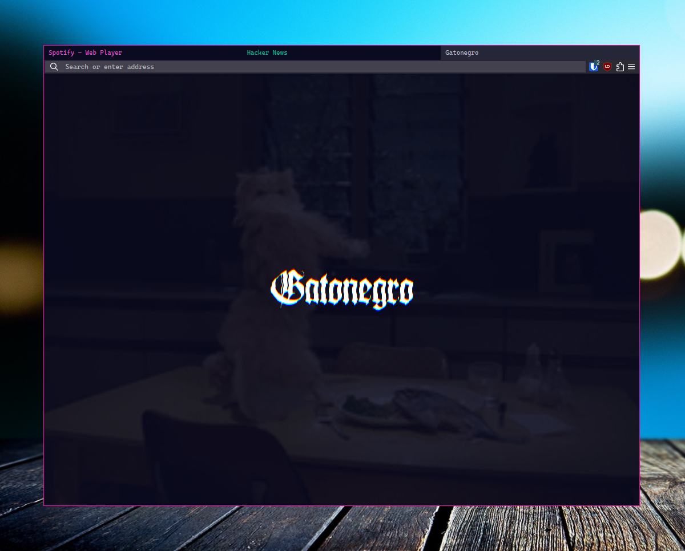
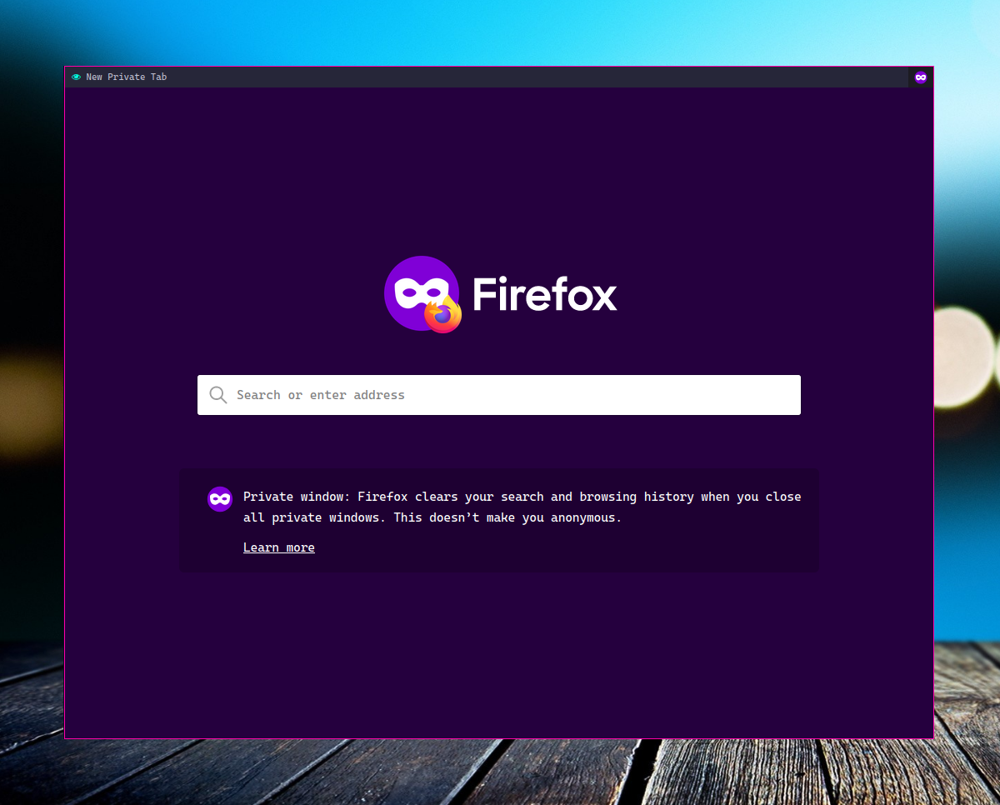

# Gatonegro's Minimal Firefox

This configuration hides the tab bar when only one tab is open, removing every
trace of the Firefox UI. With two or more tabs open, the qutebrowser-inspired
tab bar becomes visible.

In private windows the tab bar will always be visible, and an eye icon will be
drawn next to the tab name, to make it easier to distinguish between regular
and private windows.

Color of text in a tab is determined by its container. If a tab has no
container, fallback colors are used. The private tab icon, its colour, and the
fallback colourscheme for non-container tabs can all be adjusted via the
variables defined at the top of `userChrome.css`.

## How to use

Enable user chrome:

1) in `about:config` set `toolkit.legacyUserProfileCustomizations.stylesheets` to `true`

Enable compact mode:

1) in `about:config` set `browser.compactmode.show` to `true`
2) in the customize toolbar menu set `density` to `compact`

Enable dark theme in settings.

Copy `userChrome.css` to the `chrome` directory in your firefox profile. If
there is no such directory create it.

If you're unsure what the path to your profile's directory is, you can find out
by going to `about:profiles`.

Then either install the Jetbrains Mono font, or change the relevant line of
`userChrome.css` (search for 'Jetbrains Mono') to some other font that you have
installed. This affects the urlbar font.

Optionally install [tridactyl](https://github.com/tridactyl/tridactyl) or a
similar extension for best results.

## Common issues

### black stripe under tab bar

Increase the value of the `--tab-min-height` variable in `userChrome.css`.

### invisible button at the end of urlbar

This is intentional - it preserves the `Ctrl-D` functionality. If you don't
need that, you can remove it in the code. Search for `star-button-box` and
uncomment the line in question.

### I want to disable favicons

Search for 'disable favicons' and uncomment the relevant line.

### show navbar on hover

If you want navbar to show on hover go to the bottom of `userChrome.css` and
uncomment the code there. Otherwise you may only toggle the navbar by pressing
`Ctrl+L`

## Credit

This `userChrome.css` is a fork of [Dook97's userChrome.css](https://github.com/Dook97/firefox-qutebrowser-userchrome),
which is in turn a (soft) fork of [aadilayub's theme](https://github.com/aadilayub/firefox-i3wm-theme).
